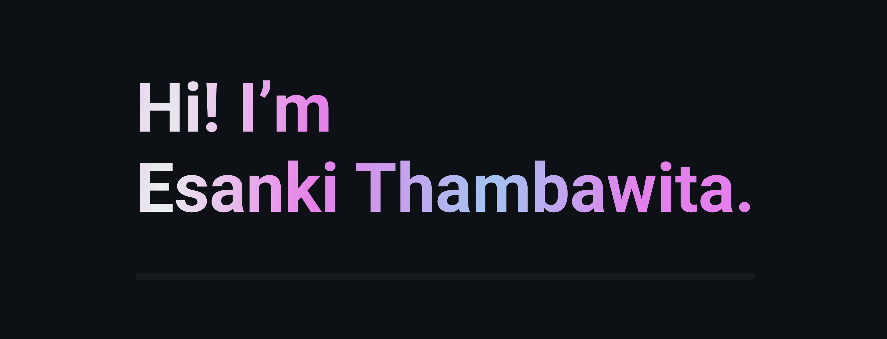

  

<h3 align="center">3rd Year Computer Science Undergraduate at NSBM Green University</h3>

  Fast learner passionate about software development, eager to contribute and grow through internships and projects.

---

## Previous Internship Experience

**Software Engineer Intern — Tecxick**  
*Jan 2024 – Jul 2024 (7 months)*

- Developed and maintained web applications using HTML5, CSS3, SCSS, JavaScript, and WordPress  
- Built standalone software using C#, XAML, and .NET Framework  
- Conducted debugging, testing, and UI/UX improvements using Figma  

---

## Tech Stack & Tools

  &nbsp;
  &nbsp;
  &nbsp;
  &nbsp;
  &nbsp;
  &nbsp;
  &nbsp;
  &nbsp;
  &nbsp;
  &nbsp;
  &nbsp;
  &nbsp;
  &nbsp;
  &nbsp;
  

  &nbsp;
  

---

## GitHub Stats

<table>
  <tr>
    <td>
      
    </td>
    <td>
      
    </td>
  </tr>
</table>
---

## Let's Connect

  
  &nbsp;
  

---

I am actively seeking **Software Engineer** and **Full Stack Developer** internships where I can contribute, learn, and grow.  
If you’re looking for a passionate, fast-learning developer to join your team, feel free to reach out!
